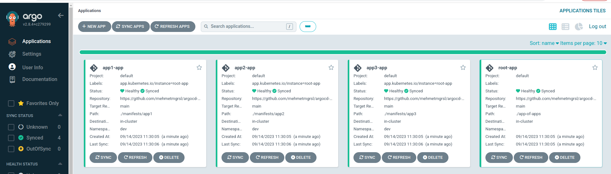
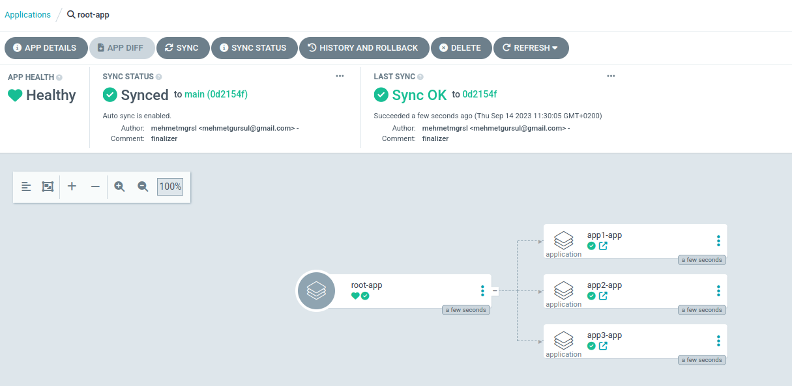

### 1. Precondition

1. Kubernetes Cluster
2. ArgoCD installation (1*)

### 2. App of Apps Pattern


### 3. Test

```kubectl apply -f app_of_apps.yaml```

#### 3.1 Applications


#### 3.2 Root App


### Resources
1. https://github.com/mehmetmgrsl/example-argocd-config
2. https://kodekloud.com/courses/argocd/
3. https://medium.com/dzerolabs/turbocharge-argocd-with-app-of-apps-pattern-and-kustomized-helm-ea4993190e7c
