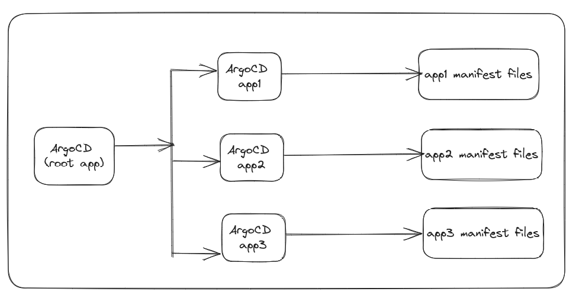

# WIP

### Precondition

1. Kubernetes Cluster
2. ArgoCD installation (1*)

### App of Apps Pattern

### Resources
1. https://github.com/mehmetmgrsl/example-argocd-config
2. https://kodekloud.com/courses/argocd/
3. https://medium.com/dzerolabs/turbocharge-argocd-with-app-of-apps-pattern-and-kustomized-helm-ea4993190e7c
